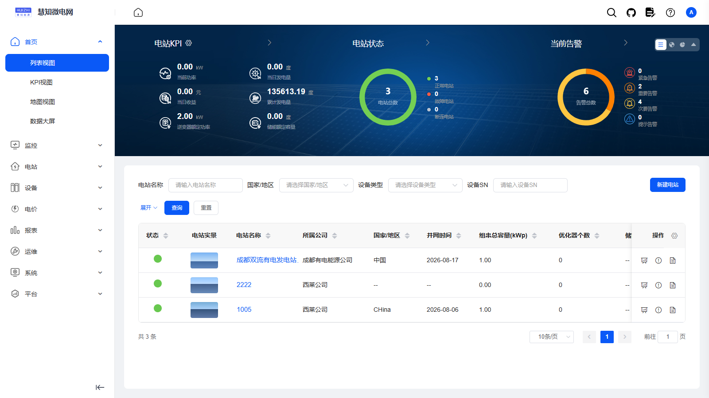
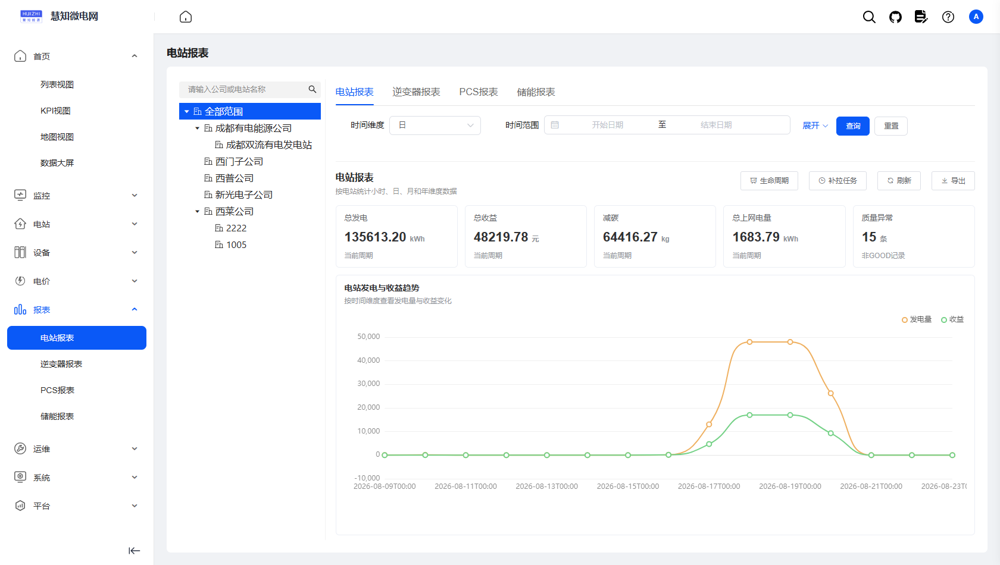
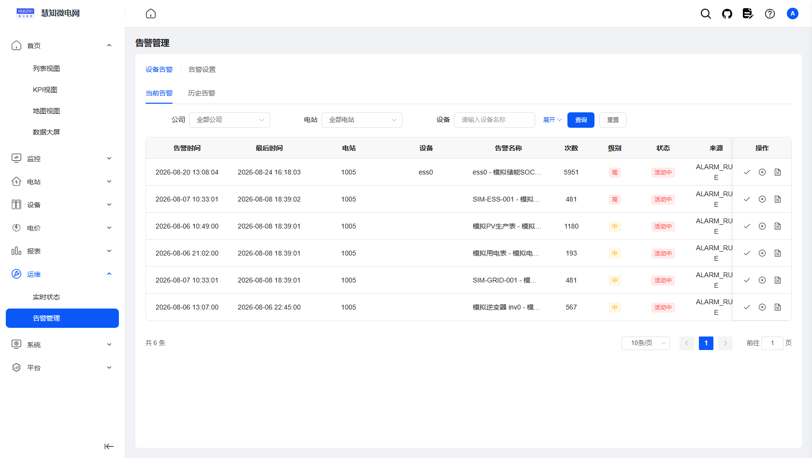
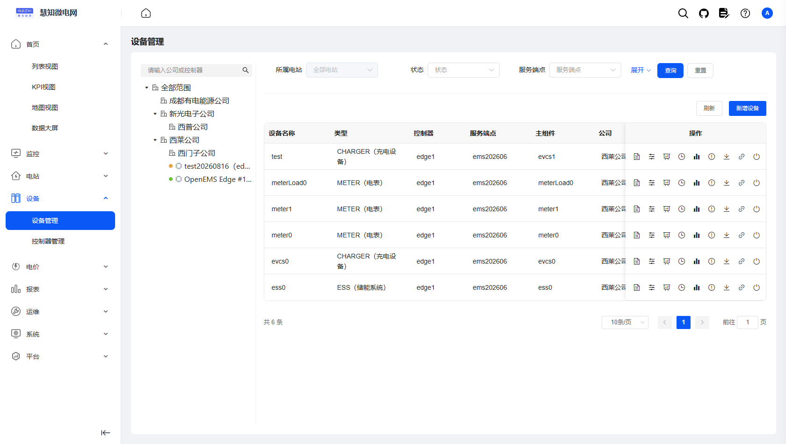
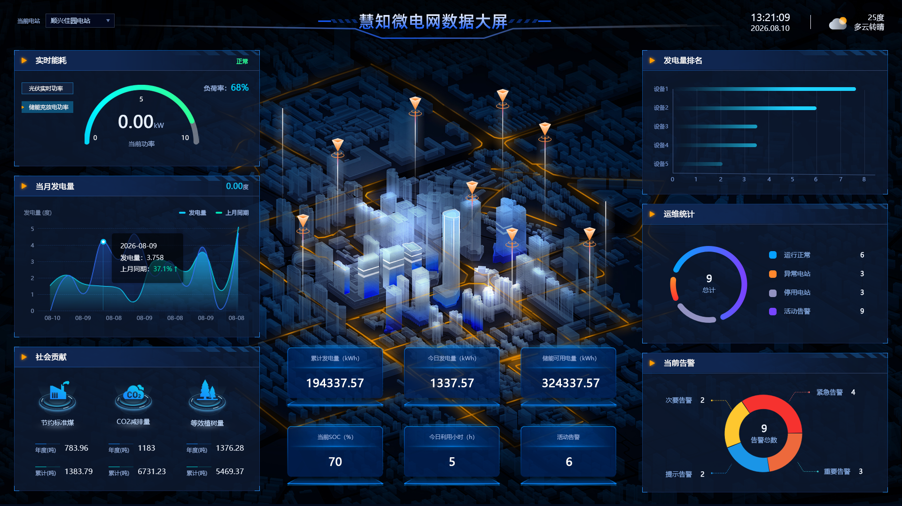

# GOEMS 能源管理系统

当前版本：3.0.8

[🔥 GOEMS平台微服务源码](https://github.com/roinli/GOEMS-cloud)（当前）

[🔥 GOEMS管理后台前端源码](https://github.com/roinli/GOEMS-admin)

[🔥 更新日志](https://blog.csdn.net/Roinli?spm=1000.2115.3001.5343)

> 基于 Spring Cloud Alibaba 的多租户能源管理云平台（EMS）

<p align="center">
    <a href="https://ems-pc.huizhidata.com/login?redirect=%2Fems-home%2Flist">在线体验</a> | <a href="https://ems-doc.huizhidata.com/">帮助文档</a>
</p>

<p align="center">
    
    
    
    
</p>

⚡️GOEMS 开源能源管理系统全套源码⚡️；⚡️能源管理系统（EMS）⚡️；⚡️储能光伏运营平台⚡️；⚡️多租户 SaaS 能源云平台⚡️；Spring Cloud Alibaba + MySQL + Redis + Nacos，多租户隔离、企业-电站-设备三级资产管理、设备智能接入、时序采集与远程管控、阈值告警与多渠道通知、多维经营报表与能量流分析、运营管理后台、数据大屏，一站式能源数字化运营解决方案。

GOEMS 基于 MIT 协议发布，代码全开源无加密、可免费商用，适合储能、光伏等能源资产运营方与集成商，快速构建「企业 - 电站 - 设备」三级资产模型的能源管理云平台。

---

## 📖 项目介绍

系统采用 Java + Spring Cloud Alibaba 微服务架构，后端基于 RuoYi-Cloud 多租户版（witos-platform）二次开发，前后端分离设计清晰。通过 GOEMS 设备接入层对接边缘能源设备，实现设备接入、时序采集、远程管控、告警通知与经营分析的完整闭环；原生多租户隔离，可同时服务多个能源运营主体，数据独立、权限隔离。







### 核心功能

#### 能源资产全链路管理
平台核心管理功能完善，包含企业（树形层级）、电站、设备三级资产管理，设备档案与心跳监测、运行状态管理，覆盖能源资产运营全流程。

#### 设备智能接入（GOEMS）
支持服务端点接入、组件与能力建模、设备绑定与生命周期管理、时序数据同步、远程指令下发等设备联动能力，实现「接入即监控、下发即管控」的闭环体验。

#### 监控告警与经营分析
实时指标监控与 5 分钟历史时序聚合，基于「阈值 + 持续时长」的告警规则与多渠道通知；提供小时/日/月/年多维度经营报表、能量流分析与首页经营驾驶舱，助力运营决策。

#### 多租户 SaaS 能力
原生支持多租户隔离架构，可同时管理多个能源运营主体，数据独立、权限隔离，满足平台化运营需求。

### 系统优势

#### 成熟稳定的微服务架构
后端 Spring Boot + Spring Cloud Alibaba，Nacos 注册与配置中心、网关统一鉴权，模块化拆分清晰。

#### 规范的接口设计
提供标准 RESTful 接口与统一数据结构，Swagger 在线文档，接口复用率高，便于二次开发与第三方系统集成。

#### 多维度经营分析
小时/日/月/年报表与能量流分析，经营数据支持 Excel 导出，助力运营决策。

#### 高效开发支持
内置代码生成器，支持前后端代码一键生成，大幅减少重复工作，提升开发效率。

#### 精细权限控制
基于 Spring Security 实现 RBAC 角色权限控制，可精确到按钮级别，支持租户数据隔离与数据权限范围，保障系统安全。

#### 高可用设计
内置 Redis 缓存、Sentinel 限流熔断、Seata 分布式事务与 XXL-JOB 定时任务，有效削峰解耦，提升系统并发能力与稳定性。

---

## 💻 技术特点

### 运行环境及框架

1. 后台服务 Java Spring Boot + Spring Cloud Alibaba + MyBatis-Plus + MySQL + Redis + Nacos
2. 运行环境 Linux 和 Windows 等都支持，只要有 Java 环境和对应的数据库、Redis、Nacos
3. 运行条件 Java 1.8、MySQL 5.7+、Redis 5+、Nacos 2.x、Maven 3.6+

### Java 项目框架版本

```
1. Spring Boot 2.7.18
2. Spring Cloud 2021.0.8
3. Spring Cloud Alibaba 2021.0.5.0
4. MyBatis-Plus 3.5.0
5. Nacos 2.1.1
6. Seata 1.5.1
7. XXL-JOB 2.3.0
8. Maven 3.6+
```

### 项目代码包介绍

```
1. witos-register              注册与配置中心（Nacos）
2. witos-gateway               微服务网关（统一鉴权、验证码、Sentinel 限流熔断）
3. witos-auth（ems-auth）       认证授权中心（登录、令牌签发）
4. witos-modules/ems_server     EMS 能源管理业务模块（企业/电站/设备/告警/报表/设备接入）
5. witos-modules/witos-system   系统管理（租户/用户/角色/菜单/字典/日志）
6. witos-modules/witos-file     文件服务（MinIO）
7. witos-modules/witos-gen      代码生成
8. witos-modules/witos-job      定时任务（XXL-JOB）
9. witos-api/witos-api-system   系统模块远程调用接口
10. witos-common/*              公共组件（核心/数据源/安全/日志/缓存/分布式事务/消息/MyBatis-Plus 扩展等）
11. witos-visual/witos-monitor  服务监控（Spring Boot Admin + OSHI）
12. witos-demo                  单体运行示例（二开模块抽离参考）
```

---

## 系统演示

在线演示：https://ems-pc.huizhidata.com/login?redirect=%2Fems-home%2Flist

演示环境权限开放，请勿随意删除数据。本地启动体验见下方「快速开始」，启动后可通过 Swagger 在线查看与调试接口。

## 📚 项目资料

- 在线文档：https://ems-doc.huizhidata.com/（使用文档 / 接口文档）
- 仓库内文档：`doc/` 目录包含 Nacos 配置示例等。
- Swagger 接口文档：部署后访问各服务 `/swagger-ui.html` 在线查看。

## 快速开始

环境要求：JDK 1.8+、Maven 3.6+、MySQL 5.7+、Redis 5+、Nacos 2.x。

1. 构建打包：执行 `bin/package.bat`（或 `mvn package`）构建各模块 Jar。
2. 初始化数据库：依次导入 `sql/witos_platform.sql`（业务库）、`sql/witos_config.sql`（Nacos 配置库）、`sql/witos_seata.sql`（分布式事务库）；EMS 增量补丁按需执行 `sql/ems_opensource_device_patch.sql`。
3. 导入 Nacos 配置：参考 `doc/` 下的 `*.yml` 示例与各服务 `resources/bootstrap.yml`，在 Nacos 配置中心创建对应 Data ID。
4. 启动服务：先启动注册中心 Nacos，再按顺序执行 `bin/run-gateway.bat` → `bin/run-auth.bat` → `bin/run-modules-system.bat` → `bin/run-modules-ems-server.bat`，其余模块按需启动。
5. 验证：在 Nacos 控制台查看服务注册情况，打开 Swagger 在线文档登录调试。

---

## 功能矩阵

| 🔴 能源业务 | 🟠 设备接入（GOEMS） | 🟡 监控告警 | 🟢 经营分析 | 🔵 平台底座 | 🟣 系统设置 | 🟤 第三方对接 |
|---|---|---|---|---|---|---|
| 企业管理 | 服务端点接入 | 实时指标监控 | 小时/日/月/年报表 | 网关路由与鉴权 | 租户管理 | 天气服务 |
| 电站管理 | 组件与能力建模 | 历史时序聚合 | 能量流分析 | 认证授权中心 | 租户套餐 | 腾讯地图 |
| 设备管理 | 设备绑定与生命周期 | 告警规则 | 首页经营驾驶舱 | Sentinel 限流熔断 | 用户管理 | 邮件通知 |
| 员工管理 | 时序数据同步 | 告警事件闭环 | 价格策略 | Seata 分布式事务 | 角色权限 | |
| 业务参数配置 | 远程指令下发 | 邮件通知 | 数据导出 | Redis 缓存 | 菜单管理 | |
| 心跳与状态监测 | 设备档案 | 告警通知日志 | | XXL-JOB 定时任务 | 部门/岗位 | |
| | | | | 代码生成器 | 数据字典 | |
| | | | | 文件服务（MinIO） | 通知公告 | |
| | | | | 服务监控 | 操作/登录日志 | |

## 相关文档

- [Nacos 配置示例](./doc/)

## 致谢

本项目基于 [RuoYi-Cloud](https://gitee.com/y_project/RuoYi-Cloud) 与 [witos-platform](https://gitee.com/witos/witos-platform) 二次开发，感谢若依开源社区与 witos 开源作者的贡献。

## 反馈与交流

- 项目主页：https://github.com/roinli/GOEMS-cloud
- 欢迎通过 GitHub Issues 提交 Bug、交流方案、获取更新动态。

---

© 2026 GOEMS 版权所有 · 开源协议：MIT License · 详见 [LICENSE](./LICENSE)